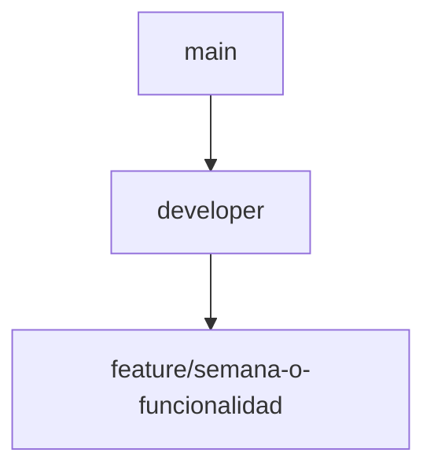

# Flujo Git del módulo ASII-15

## Flujo utilizado hasta Semana 2

La evidencia verificable del repositorio muestra lo siguiente:

- `git branch -a` reporta las ramas locales `main` y `feat/mod15-prescripciones-vanilla`.
- `git remote -v` apunta al repositorio `origin` de `Mar-03`.
- `git log --oneline --decorate -15` confirma los commits de Semana 1 y Semana 2 en la historia revisada.
- `git status` debe mantenerse limpio salvo archivos nuevos de documentación o imágenes no modificadas por esta entrega.

Comportamiento histórico observado:

- Semana 1 quedó registrada en `main` con el commit `020a111 agregar diagramas UML de semana 1`.
- Semana 2 quedó registrada en `main` con los commits de requisitos, diseño DIP, evidencias y validación.

## Flujo recomendado a partir de ahora

- `main`: rama estable para entrega.
- `developer`: rama de integración previa a entrega.
- `feature/*`: rama aislada para cada avance o funcionalidad.

## Recomendación

Si se decide adoptar este flujo desde ahora, la rama `developer` debería crearse a partir del estado estable de `main` para conservar la base académica intacta.
